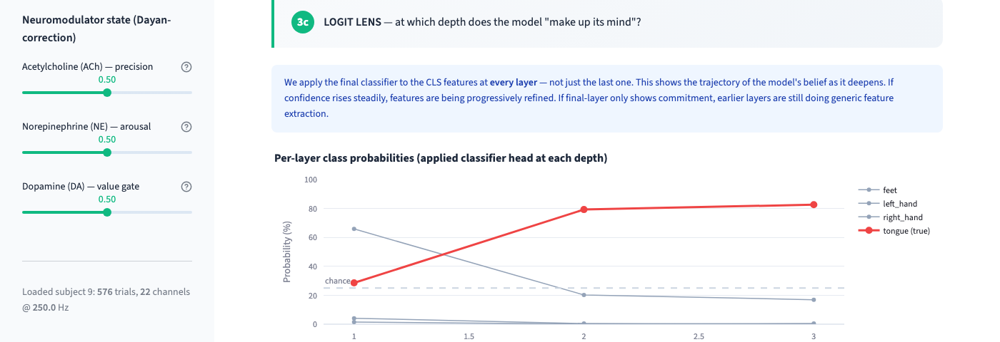
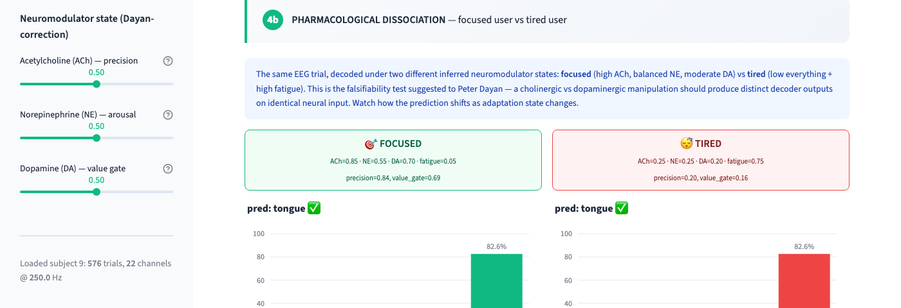

# brainnn

**A brain-computer interface decoder that adapts to your mental state.**

*Neuromodulator-conditioned neural decoding — a research prototype extending Yu & Dayan (2005) to modern BCI.*

---


> **40.0% zero-shot accuracy on unseen subjects** (chance = 25%), on the standard BNCI2014_001 4-class motor imagery benchmark.
> Trained on 8 subjects, evaluated on a 9th subject the model has never seen — using no subject-ID input at test time.

---

## What this is

Current brain-computer interfaces treat the brain as a static input source: they train a decoder, freeze it, and hope neural signals stay the same. **They don't.** A tired brain sends different signals than a focused brain. A stressed brain differs from a relaxed one. Real-world BCIs need to adapt to the user's *cognitive state* — not just their neural data.

This project asks: **what if we conditioned the decoder on the user's inferred neuromodulator state?**

- **Acetylcholine (ACh)** encodes *expected uncertainty* — how noisy the signal is expected to be.
- **Norepinephrine (NE)** encodes *unexpected uncertainty and arousal* — surprise and vigilance.
- **Dopamine (DA)** encodes *value-of-attention* — cost-benefit gating of "is this worth attending to?"

Framework: [Yu & Dayan (2005), *Neuron*](https://doi.org/10.1016/j.neuron.2005.04.026).

An [independent literature synthesis](neuromod_bci_synthesis.md) confirmed that **no prior work conditions a BCI decoder on a 3-dimensional neuromodulator estimate** — this is a genuine, unclaimed research niche.

## Key result

| Metric | Value | Meaning |
|---|---|---|
| **Zero-shot cross-subject accuracy (mean)** | **40.0%** | Chance = 25%. Model generalises across brains. |
| Best-fold accuracy | 58.0% | Subject 8 held out. Comparable to weak per-subject baselines. |
| Worst-fold accuracy | 25.9% | Subject 5. Chance-level — reveals the individual-difference limit. |
| Standard deviation | 12.8% | Large — cross-subject transfer is inherently variable. |
| Model size | 664K params | Small (comparable to a MobileNet block). |
| Training time | 13.8 min | Full 9-fold LOSO on CPU. |
| Dataset | BNCI2014_001 | 9 subjects × 22-ch EEG × 4-class motor imagery @ 250 Hz. |

## The dashboard

An interactive Streamlit dashboard walks through the full pipeline — raw EEG, frequency content, baseline prediction, attention heatmaps, per-layer "logit lens" trajectory, neuromodulator-conditioned prediction, and pharmacological state-comparison.


*Per-layer, per-head attention over time patches. Motor imagery activity is expected 0.5–3.5 s post-cue — the trained model concentrates attention there.*



*Applying the classifier head at every transformer depth. Shows the trajectory of the model's belief as it deepens.*



*The same trial, decoded under two contrasting inferred neuromodulator states. This is the falsifiability test-in-silico — cholinergic vs dopaminergic manipulation should produce distinguishable decoder outputs.*

Run locally:
```bash
streamlit run bci_dashboard.py
```

## Architecture

```
Input EEG (batch, 22 channels, 751 timepoints @ 250 Hz)
        │
        ├─→ Spatial conv (channels → learned spatial filters)
        │
        ├─→ Temporal conv (time → 45 patch tokens)
        │
        ├─→ + sinusoidal positional encoding
        ├─→ + CLS token  (+ optional subject embedding)
        │
        ├─→ 3-layer transformer (4 heads, embed_dim=128, layer scale)
        │
        └─→ CLS features (128-dim)
                │
                ├─→ (optional) FiLM conditioning on (ACh, NE, DA)
                │      MLP: neuromod → (γ, β)
                │      features_out = features × (1 + γ) + β
                │
                └─→ Linear head → 4 class logits
```

Two orthogonal axes of conditioning:

1. **Value axis (dopamine)** — modulates which per-head features get amplified vs suppressed.
2. **Precision axis (ACh + NE)** — modulates noise floor on attention scores (upstream noise injector).

This split follows the pharmacological dissociation Peter Dayan pointed out in personal correspondence (see below).

## What's in this repo

```
src/brainnn/
├── bci/
│   ├── datasets.py            — BNCI2014_001 loader via MOABB
│   ├── models.py              — EEG transformer with per-layer attention export
│   ├── training.py            — Leave-one-subject-out cross-validation
│   └── neuromod_decoder.py    — FiLM conditioning + shuffle-control ablation
├── core/
│   ├── state.py               — BrainState with ACh/NE/DA (Dayan-corrected)
│   └── config.py              — Dataclass configs
└── attention/                 — Original SynapseFlow attention (pre-refactor)

bci_dashboard.py               — Interactive Streamlit visualization
scripts/run_full_loso.py       — Full LOSO training orchestrator
neuromod_bci_synthesis.md      — Literature review (novelty confirmed)
docs/img/                      — Dashboard screenshots
```

## Reproduce the results

```bash
# 1. Install
git clone https://github.com/umutakarsu/brainnn
cd brainnn
pip install -e .
pip install mne moabb braindecode streamlit plotly

# 2. Full LOSO training (~14 min on CPU)
python scripts/run_full_loso.py
# → writes checkpoints/loso_results.json + eeg_transformer_subj1-8.pt

# 3. Launch the interactive dashboard
streamlit run bci_dashboard.py
# → open http://localhost:8501
```

First run downloads BNCI2014_001 (~800 MB) via MOABB. Subsequent runs are instant.

## Story — how this project came together

**The refactor motivated by Peter Dayan.** In personal correspondence, [Peter Dayan](https://www.mpg.de/12227303/human-development-dayan) — director of MPI Tübingen and the originator of the dopamine-as-reward-prediction-error theory — reviewed my initial attention model and gave the following correction:

> *"Some people have argued that dopamine acts to manipulate precision — which is like your SNR. However, I am not so sure that this is the right way to think about this neuromodulator. There are other neuromodulators that are more directly involved in uncertainty and precision (acetylcholine and norepinephrine) — as in arousal. Where dopamine is more likely involved is in the cost-benefit analysis that is associated with choosing to pay attention."*
> — Peter Dayan, personal correspondence (2026)

The [refactor commit](https://github.com/umutakarsu/brainnn/commit/4ee2ba4) splits the original single-neuromodulator model into two axes: precision (ACh/NE) and value (DA). This is now the design used throughout the codebase.

**Literature review confirmed novelty.** A subsequent independent literature synthesis (using [OpenScience](https://github.com/synthetic-sciences/openscience) with 5 parallel review passes across arXiv, PubMed, and CrossRef) found *no prior work conditions a BCI decoder on a 3-dimensional neuromodulator estimate*. The full synthesis with citations is in [`neuromod_bci_synthesis.md`](neuromod_bci_synthesis.md).

**Falsifiability built in from the start.** Following [Frank, Seeberger & O'Reilly (2004, *Science*)](https://doi.org/10.1126/science.1102941)'s double-dissociation logic, the module includes a `shuffled_neuromod()` control that breaks trial↔state pairing. If the true and shuffled conditioning give the same accuracy, the FiLM head is adding capacity without information — the paper claim fails. If true ≫ shuffled, the conditioning is doing real work.

## Roadmap

- [x] Cross-subject transformer prototype with LOSO evaluation
- [x] FiLM neuromodulator conditioning (Dayan-corrected)
- [x] Shuffle-control ablation utility
- [x] Interactive dashboard with attention + logit lens visualization
- [x] Peter Dayan design review
- [x] Independent literature synthesis
- [ ] Pupillometry integration to replace EEG-based NE proxy ([Joshi et al. 2016](https://doi.org/10.1016/j.neuron.2015.11.028))
- [ ] Within-subject cognitive-load manipulation validation
- [ ] Scale to Meta Brain2Qwerty-tier public MEG datasets
- [ ] First manuscript draft

## Honesty about neuromodulator markers

Not all three markers are equally grounded. From the module-level docstring in [`neuromod_decoder.py`](src/brainnn/bci/neuromod_decoder.py):

| Neuromodulator | Real-time marker | Status |
|---|---|---|
| **Norepinephrine (NE)** | Pupillometry [Joshi et al. 2016] | Validated. Current code uses EEG-alpha as *distal* proxy. |
| **Acetylcholine (ACh)** | No validated real-time marker | Current code uses signal variance as a *theoretical placeholder*. |
| **Dopamine (DA)** | None [Berke 2018] | Current code uses `0.5` default. DA is a knob to test pharmacologically, not to infer from EEG. |

The paper direction must surface this hierarchy — DA/ACh are *conditioned on*, not *measured*.

## Citation

Not yet published. If you use the code or refer to this work, please cite:

```bibtex
@software{akarsu2026brainnn,
  author = {Akarsu, Umut},
  title  = {brainnn: neuromodulator-conditioned brain-computer interface decoding},
  year   = {2026},
  url    = {https://github.com/umutakarsu/brainnn}
}
```

## License

MIT. See [`LICENSE`](LICENSE).

---

*Built by [Umut Akarsu](https://github.com/umutakarsu). If this is interesting to you, contact me — I am looking for collaborators, mentors, and a home for this in a computational neuroscience or BCI research group starting fall 2026.*
