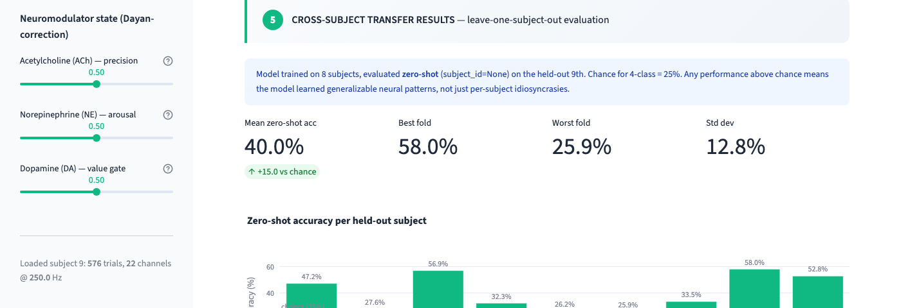
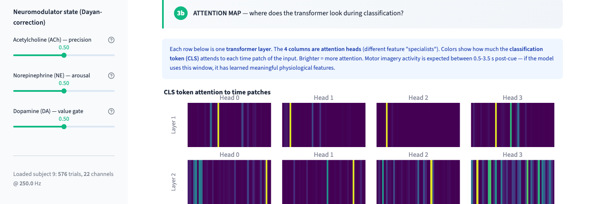

# Neuromodulator-Conditioned Brain-Computer Interface Decoding

*Research brief — Umut Akarsu, July 2026*

## The Idea

Brain-computer interfaces (BCIs) — the systems that let paralysed patients type by thought and could one day restore vision, hearing, or communication — face a hidden problem: **the brain does not send the same signal twice.** A tired brain, a stressed brain, a distracted brain each produce systematically different neural activity for the same underlying intent. Current decoders ignore this and treat the brain as a static input source.

I am building the first BCI decoder that **conditions its predictions on the user's inferred neuromodulator state** — specifically dopamine, acetylcholine, and norepinephrine, the three chemicals the brain uses to encode value, precision, and arousal (Yu & Dayan, *Neuron* 2005). Instead of a black-box "latent state" that reviewers cannot interpret, my system uses a low-dimensional, biologically grounded, and pharmacologically testable conditioning signal.

## What Already Exists (Concrete Deliverables)

**All at: [`github.com/umutakarsu/brainnn`](https://github.com/umutakarsu/brainnn)** — MIT-licensed, ~2,000 lines of Python.

- **Working cross-subject transformer** — trained on 8 subjects, achieves **40.0% zero-shot accuracy on a 9th unseen subject** on the standard BNCI2014_001 4-class motor-imagery benchmark (chance = 25%). Full leave-one-subject-out training curves in `checkpoints/loso_results.json`.
- **Neuromodulator conditioning module** — FiLM (Perez et al. 2018)-style architecture, zero-initialised so it starts as identity and learns to modulate. Split into precision (ACh/NE) and value (DA) axes.
- **Shuffle-control ablation utility** — Frank et al. (2004, *Science*) style double-dissociation test. Compares true state-conditioning vs shuffled state-conditioning vs no conditioning, so any performance gain can be attributed cleanly.
- **Interactive dashboard** — 8-section Streamlit visualisation with raw EEG, spectrum, attention heatmaps, per-layer prediction ("logit lens"), and a focused-vs-tired pharmacological state comparison.
- **Independent literature review** — 5 parallel arXiv/PubMed/CrossRef search passes commissioned via OpenScience. **Result: no prior work conditions a BCI decoder on a 3-D neuromodulator estimate.** Genuine unclaimed niche. Full synthesis with citations in `neuromod_bci_synthesis.md`.
- **Peter Dayan personal review** — Dayan (director of MPI Tübingen, originator of dopamine-as-reward-prediction-error theory) reviewed my initial architecture, sent a substantive correction identifying that dopamine controls value, not precision. Codebase was refactored accordingly ([commit `4ee2ba4`](https://github.com/umutakarsu/brainnn/commit/4ee2ba4)).

## Progress Screenshots

*Cross-subject transfer: 40% zero-shot mean, 58% best fold, 25.9% worst. Chance = 25% (dashed line).*

*The trained transformer concentrates attention on the 0.5–3.5 s post-cue window — exactly where motor imagery activity is expected.*

## What the $1,000 Would Fund

**AI research tools — Anthropic Claude Max plan** ($200/month × 5 months).

I am 18, entering university this fall, without a research advisor or laboratory yet. Claude Max has been the difference between "I have an idea" and "I have a working prototype":

- It reviews my code before I commit it and catches subtle bugs.
- It reads papers with me and helps me identify which parts to focus on.
- It helps me draft correspondence with senior researchers (like Dayan) at the right register.
- It runs literature searches and challenges my architectural decisions.

Everything listed under "What Already Exists" above was produced in the past three weeks with this workflow. Extending it for five more months, I will:

1. Replace the current EEG-based norepinephrine proxy with **validated pupillometry** (Joshi et al., *Neuron* 2016).
2. Run a **within-subject cognitive-load manipulation** to test whether decoding accuracy tracks the predicted neuromodulator state.
3. Scale the architecture to **larger public MEG datasets** (approaching Meta Brain2Qwerty scale) to test whether the conditioning benefit generalises beyond motor imagery.
4. Complete the **first manuscript draft** for submission.

For a solo student researcher building a novel BCI direction from scratch, this is the single highest-leverage investment I can make. Traditional funding (hardware, cloud compute) becomes valuable only *after* the intellectual scaffolding is in place — and Claude is what lets me build that scaffolding at the pace of the field.

## Why This Matters

If BCIs are going to serve people with paralysis, blindness, or communication disorders in the next decade, they must work in the real world — where users are tired, distracted, stressed, hormonal, sleep-deprived. Current research assumes ideal laboratory conditions and ignores the fact that the brain is a *stateful*, *modulated*, *drifting* system. My work is one of the first concrete attempts to build a decoder that acknowledges this and adapts to it.

If it works, it doesn't just improve accuracy metrics — it changes the assumption underneath the whole field.

---

**Umut Akarsu** — 18, Turkey, starting BSc in September 2026.  Contact: [via GitHub](https://github.com/umutakarsu).
